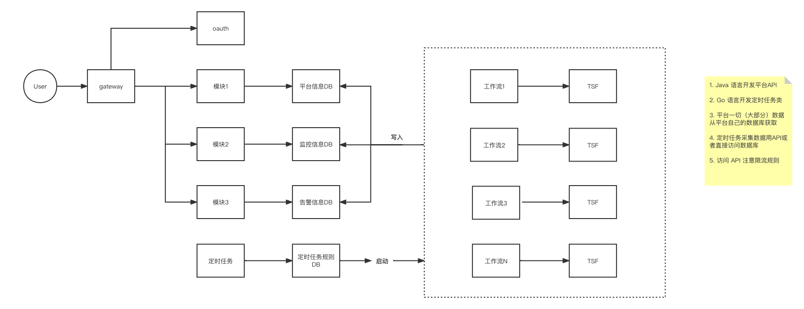
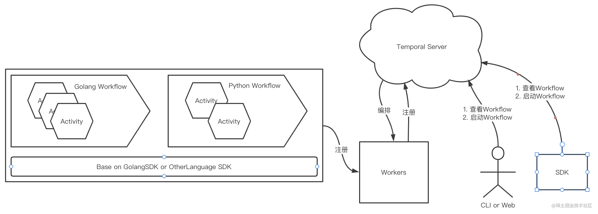

# TSF看板定时任务
### 介绍
定时任务系统定义多个工作流（workflow），每个工作流获取 TSF 一个或多个接口的数据，然后存储到数据库，供看板平台展示

### 定时任务系统 temporal
定时任务系统使用的是 [temporal](https://github.com/temporalio/temporal)  
temporal 是一个分布式任务的开源框架，能处理的不仅仅是定时任务  

它具有任务的定时，重试，恢复，并行执行任务，多语言支持，web界面查询，SDK，CLI 工具管理  

### 核心概念介绍
+ Activity: 它定义了你的业务逻辑，且不限制语言
+ Workflow: 一个或多个 Activity 的集合，也是 temporal 最小的执行单元
+ Workers: 多个 worker 的集合，会轮询 temporal server 获取 workflow 并执行，但是 work 只执行自己注册的任务，类似一个消费者
+ Temporal Server: 整个系统的核心，里面细分了多个组件  
更多文档参考 https://docs.temporal.io/

### 运行
1. 首先运行 temporal Server `https://github.com/temporalio/docker-compose`
2. 然后启动一个 worker `go run worker/main.go`
3. 然后运行一次 start 启动一个 workflow `go run start/main.go`
4. 打开 web 端 `http://ip:8080` 查看任务执行情况

### 开发计划
- [x] temporal 服务正常运行
- [x] Go Hello World 程序能连接上 temporal 并被调度到 worker 上执行
- [x] 根据原型图规划 TSF 看板代码目录结构
- [ ] 数据库规划设计
- [ ] 明确定时任务调用 TSF 方式（查数据库 / 模拟HTTP请求 / SDK）
- [ ] 编写公共组件库(数据库连接 / TSF请求 / 工具方法)
- [ ] 集群信息、服务信息、平台信息、监控信息等业务开发